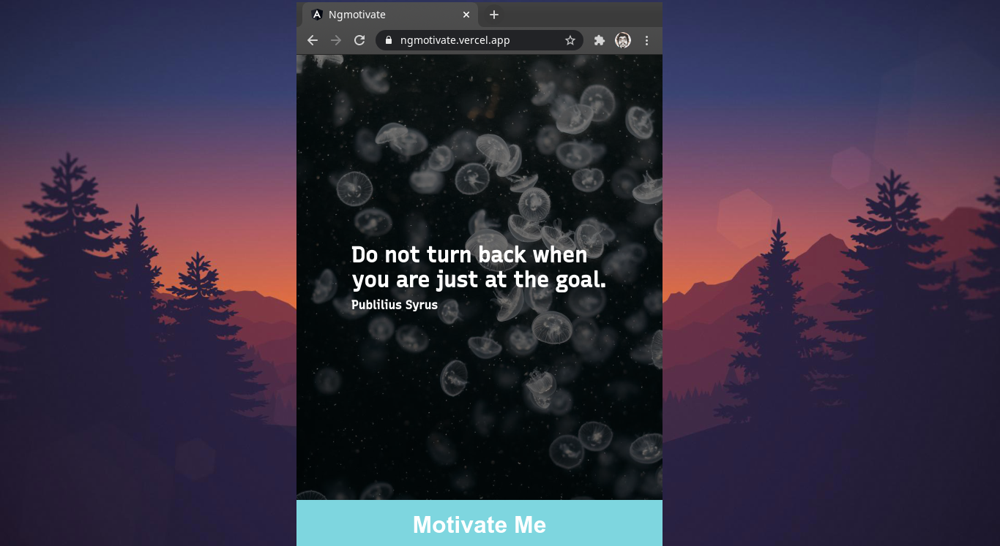

# ngMotivate

A simple motivational app built on Angular that displays random quote with a random background image.
The app uses https://api.pexels.com as the images API and https://type.fit/api/quotes as the quotes API.

## Use the app

Visit : https://ngmotivate.vercel.app/

## Try the app localy

Clone the repo `git clone https://github.com/VishnuDileesh/ngMotivate`

## Development server

Run `ng serve` for a dev server. Navigate to `http://localhost:4200/`. The app will automatically reload if you change any of the source files.

## Build

Run `ng build` to build the project. The build artifacts will be stored in the `dist/` directory. Use the `--prod` flag for a production build.

